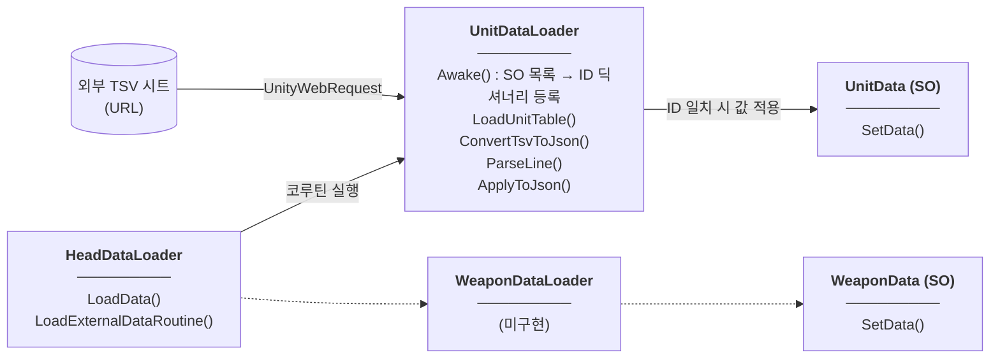

# 구현 다이어그램
> 구현마다 이 파일 하나를 최신화하여 갱신한다.
>
> 점선은 미구현 흐름을 나타낸다.

## 외부 데이터 로딩 (F-01)

```mermaid
flowchart LR
    Sheet[("외부 TSV 시트<br/>(URL)")]

    Head["<b>HeadDataLoader</b><br/>─────────<br/>LoadData()<br/>LoadExternalDataRoutine()"]

    UnitLoader["<b>UnitDataLoader</b><br/>─────────<br/>Awake() : SO 목록 → ID 딕셔너리 등록<br/>LoadUnitTable()<br/>ConvertTsvToJson()<br/>ParseLine()<br/>ApplyToJson()"]

    WeaponLoader["<b>WeaponDataLoader</b><br/>─────────<br/>(미구현)"]

    UnitSO["<b>UnitData (SO)</b><br/>─────────<br/>SetData()"]

    WeaponSO["<b>WeaponData (SO)</b><br/>─────────<br/>SetData()"]

    Head -->|코루틴 실행| UnitLoader
    Sheet -->|UnityWebRequest| UnitLoader
    UnitLoader -->|ID 일치 시 값 적용| UnitSO

    Head -.-> WeaponLoader
    WeaponLoader -.-> WeaponSO
```
